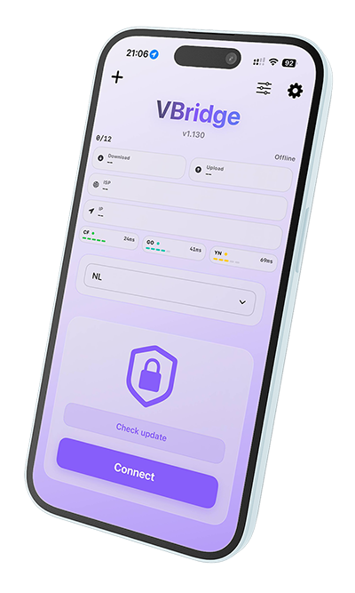

# VBridge

**VBridge** is annetwork utility. It allows you to securely route your iOS network traffic through TURN servers and WireGuard / Amnezia WG endpoints.

To run the application, you must use a [server](https://github.com/cacggghp/vk-turn-proxy/releases/tag/v1.0.0) running on a VPS.

The project is based on the repositories listed in the **Acknowledgments** section.

## Extended features:

* **Auto-Update Pipeline:** The app can check GitHub Releases and download the latest IPA directly.
* **Manual Update Trigger:** Dedicated **Check update** action on the main screen.
* **Manual Captcha Mode:** Optional mode to disable automatic captcha solving and force manual flow.
* **Theme Control:** User-selectable app theme (System / Light / Dark).
* **Modernized UI:** Refreshed iOS-style layout with glass cards and status-focused connect controls.
* **CI/CD Release Automation:** GitHub Actions build pipeline with automatic versioning (`1.X`) and release artifact publishing.

## ✨ Features

* **Custom Routing:** Route your traffic through specific TURN protocols and WG endpoints.
* **WireGuard & Amnezia WG Integration:**
  - Complete WireGuard protocol support with key management, routing, and DNS configuration
  - Full Amnezia WireGuard obfuscation support including jitter parameters (Jc, Jmin, Jmax), packet size obfuscation (S1-S4), and magic headers (H1-H4)
* **1-Click Import:** Quickly import complex configurations via base64-encoded clipboard links (`vbridge://`).
* **Multi-Profile Management:** Create, edit, and seamlessly switch between multiple VPN configurations using a convenient dropdown picker.

## 📸 Screenshot



## 🚀 Installation & Build

To build and run VBridge locally, you need a macOS environment with Xcode installed, as well as Go (for compiling the WireGuard/TURN bridge).

> ⚠️ **Important:** VBridge uses a Network Extension (VPN). Signing with a **free Apple ID** (via standard AltStore or Sideloadly) **will not work** because free accounts lack the required VPN entitlements. You must use a paid Apple Developer account ($99/year) or a third-party paid signing service.

1. **Clone the repository:**

   ```bash
   git clone https://github.com/nullcstring/turnbridge.git
   cd VBridge
   ```
2. **Build the Go Bridge:**
   Ensure you have Go installed (`brew install go`).

Modify the Go path in the script at script/build_wireguard_go_bridge.sh, according to your setup. Refer to [this Stack Overflow answer](https://stackoverflow.com/a/64212121) for guidance.

3. **Open the project in Xcode:**
   Open the Xcode project (or `.xcworkspace` if applicable) in Xcode.
4. **Configure Code Signing:**

* Select the `VBridge` project in the Project Navigator.
* Go to the **Signing & Capabilities** tab.
* Select your personal Apple Developer Team.
* Ensure you update the Bundle Identifier (for both the main app and the `network-extension` target) to match your team provisioning profile.

5. **Build and Run:**
   Select your target device (iPhone/iPad) and press `Cmd + R` to build and run the app.

## 📲 Install Pre-built IPA

If you don't have a Mac or Xcode, you can download the pre-built unsigned IPA from the [Releases](https://github.com/nullcstring/turnbridge/releases) page and sign it yourself.

### Signing & Installation

**Manual Installation Tools:**
If you already possess a paid Apple Developer certificate (or bought one from the services above), you can sign and install the IPA yourself using:

| Tool                                 | Requirement                                                                                                                |
| ------------------------------------ | -------------------------------------------------------------------------------------------------------------------------- |
| [KravaSign](https://www.kravasign.com/) | ⚠️ Without a developer certificate, price $10 https://github.com/nullcstring/turnbridge/issues/2#issuecomment-4129716584 |
| [GBox](https://gbox.run)                | Paid Certificate Needed                                                                                                    |
| [ESign](https://esign.yyyue.xyz)        | Paid Certificate Needed                                                                                                    |

## 🛠 Usage (Configuration Import)

VBridge uses a specific JSON structure encoded in Base64 for fast configuration imports for WireGuard / Amnezia WG.

### Configuration JSON Structure

```json
{
  "turn": "https://vk.com/call/join/...",
  "peer": "SERVER_IP:PORT",
  "listen": "127.0.0.1:9000",
  "n": 1,
  "wg": "[Interface]\nPrivateKey = ...\nAddress = 10.100.0.2/32\nDNS = 8.8.8.8\nMTU = 1280\n\n[Peer]\nPublicKey = ...\nAllowedIPs = 0.0.0.0/0\nEndpoint = 127.0.0.1:9000\nPersistentKeepalive = 25"
}
```

### Generate a Quick Import Link

You can use the included `quick_link.py` script to easily generate valid `vbridge://` clipboard links.

1. Open `quick_link.py` in your text editor and replace the placeholder values in the `config` dictionary with your actual server parameters and WireGuard keys.
2. Run the script from your terminal:

   ```bash
   python3 quick_link.py
   ```
3. Copy the generated `vbridge://...` link from the terminal output to your iOS clipboard.
4. Open VBridge, tap the `+` icon, select **Paste from Clipboard**, and tap **Connect**.

## Support VBridge

**Crypto:**

* **TON:** UQCwaqdfd_mAjc1GYvgYOI7CDDNXgOlTiZvRFI2SvjvfY8Tm

## License

VBridge is released under the [GNU General Public License v3.0](LICENSE).

Copyright (C) 2026 prodject

This program is free software: you can redistribute it and/or modify
it under the terms of the GNU General Public License as published by
the Free Software Foundation, either version 3 of the License, or
(at your option) any later version.

This program is distributed in the hope that it will be useful,
but WITHOUT ANY WARRANTY; without even the implied warranty of
MERCHANTABILITY or FITNESS FOR A PARTICULAR PURPOSE. See the
GNU General Public License for more details.

---

## Acknowledgements

This project was made possible thanks to the work of the open-source community. It includes code and concepts from the following excellent repositories:

* [turnbridge](https://github.com/nullcstring/turnbridge) — Original iOS client base and design direction.
* [WireGuard-Apple](https://github.com/ut360e/wireguard-apple) — Licensed under MIT / GPL.
* [Wireguardkit](https://github.com/Shahzainali/Wireguardkit) — Licensed under MIT / GPL.
* [vk-turn-proxy](https://github.com/cacggghp/vk-turn-proxy) — Licensed under the GNU GPL.
* [Amneziawg-Apple](https://github.com/amnezia-vpn/amneziawg-apple.git) — Licensed under MIT.
* [proxy-turn-vk-android](https://github.com/amurcanov/proxy-turn-vk-android) — Android implementation references.
